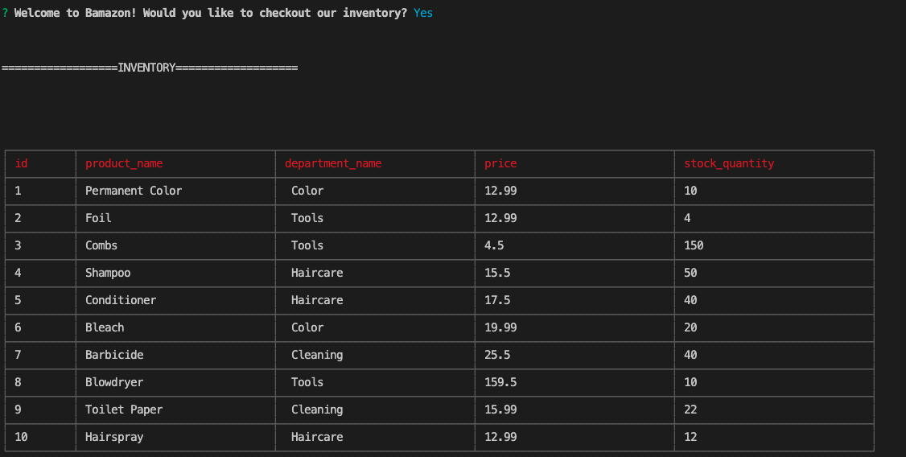
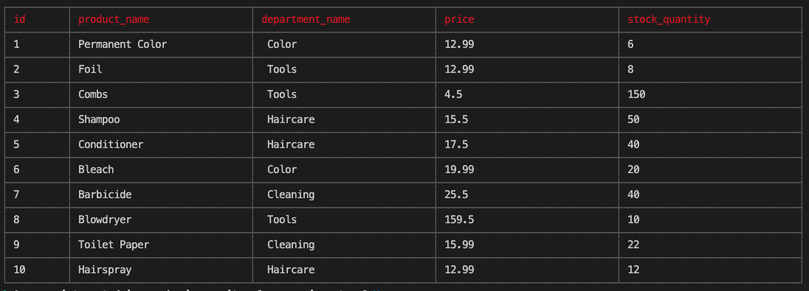
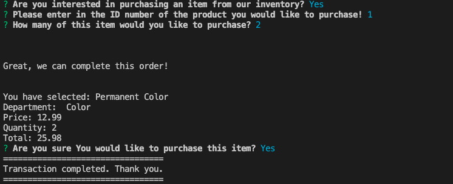

# Bamazon

## Challenge 1 (Customer View)

In this project, I was told to make an application that used SQL and NodeJs.

I also used NPM packages: "cli-table3", "inquirer", and "mysql"

The application makes a table of the products, and keep count of the inventory based on what the client purchase. 

The Application first starts off by asking the user if they would like to view the current inventory. 

If the user confirms the question by saying yes, the application then goes to show the user the inventory table!

If then the user sees an item they wish to purchase, the application asks them for the amount, then adds up the items, to give the user the final total. 

If the user does not see an item they want to purchase, the application logs "Sorry to hear that! Come back soon!!"

